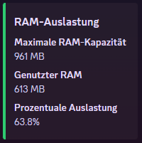
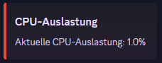
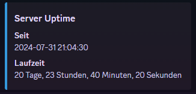
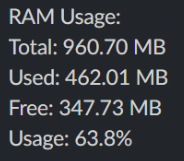
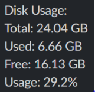

# Server Monitoring Bot

This repository contains bots for Discord and Slack to monitor your server's system metrics, such as RAM usage, CPU load, and uptime/disk usage.

- [English Version](#english-version)
- [Deutsche Version](#deutsche-version)

---

## English Version

### 1. Discord Bot Setup

The Discord bot provides insights into your server's current status. Here are some examples of the available commands:

**`/ram`**:


**`/cpu`**:


**`/uptime`**:


#### Installation Instructions:
1. Download the Discord Bot ZIP file from the [Releases page](https://github.com/PaccoTheTaco/Server_Monitoring/releases).
2. Extract the contents of the ZIP file and move them to a folder of your choice on your server.
3. Ensure that Python is installed on your server by running:
   ```bash
   python --version
   # or
   python3 --version
   ```
   If Python is not installed, install it using:
   ```bash
   sudo apt-get install python3
   ```
4. Install the Python package manager `pip`:
   ```bash
   sudo apt-get install python3-pip
   ```
5. Navigate to the bot's directory and install the required Python packages:
   ```bash
   pip install -r requirements.txt
   ```
6. In the same directory, create a `.env` file. Add the following line to it:
   ```env
   DISCORD_TOKEN=your_token_here
   ```
   Replace `your_token_here` with the bot token obtained from the [Discord Developer Portal](https://discord.com/developers/applications).
7. Start the bot by executing:
   ```bash
   python3 bot.py
   ```
*Note: Don't forget to invite the Discord bot to your server!*

---

### 2. Slack App Setup

The Slack app offers similar functionalities. Here are some examples of the available commands:

**`/ram`**:


**`/cpu`**:


**`/diskusage`**:


#### Installation Instructions:
1. Download the Slack App ZIP file from the [Releases page](https://github.com/PaccoTheTaco/Server_Monitoring/releases).
2. Extract the contents and move them to a folder of your choice on your server.
3. Ensure that Python is installed by running:
   ```bash
   python --version
   # or
   python3 --version
   ```
   If not installed, install Python using:
   ```bash
   sudo apt-get install python3
   ```
4. Install the Python package manager `pip`:
   ```bash
   sudo apt-get install python3-pip
   ```
5. Navigate to the app's directory and install the required Python packages:
   ```bash
   pip install -r requirements.txt
   ```
6. In the same directory, create a `.env` file. Add the following line to it:
   ```env
   SLACK_TOKEN=your_token_here
   ```
   Replace `your_token_here` with the token obtained from the [Slack API Portal](https://api.slack.com/apps).
7. Start the app by executing:
   ```bash
   python3 bot.py
   ```
The commands should now be available in your Slack workspace.

---

## Deutsche Version

### 1. Discord Bot Einrichtung

Der Discord-Bot bietet Einblicke in den aktuellen Status deines Servers. Hier sind einige Beispiele der verfügbaren Befehle:

**`/ram`**:


**`/cpu`**:


**`/uptime`**:


#### Installationsanleitung:
1. Lade die Discord Bot ZIP-Datei von der [Releases-Seite](https://github.com/PaccoTheTaco/Server_Monitoring/releases) herunter.
2. Entpacke die ZIP-Datei und verschiebe den Inhalt in einen Ordner deiner Wahl auf deinem Server.
3. Stelle sicher, dass Python auf deinem Server installiert ist:
   ```bash
   python --version
   # oder
   python3 --version
   ```
   Falls Python nicht installiert ist, installiere es mit folgendem Befehl:
   ```bash
   sudo apt-get install python3
   ```
4. Installiere die Python-Paketverwaltung `pip`:
   ```bash
   sudo apt-get install python3-pip
   ```
5. Navigiere in das Verzeichnis des Bots und installiere die benötigten Python-Pakete:
   ```bash
   pip install -r requirements.txt
   ```
6. Erstelle im gleichen Verzeichnis eine `.env`-Datei und füge den folgenden Inhalt hinzu:
   ```env
   DISCORD_TOKEN=dein_token_hier
   ```
   Ersetze `dein_token_hier` durch den Token, den du dir aus dem [Discord Developer Portal](https://discord.com/developers/applications) geholt hast.
7. Starte den Bot im gleichen Verzeichnis mit folgendem Befehl:
   ```bash
   python3 bot.py
   ```
*Hinweis: Vergiss nicht, deinen Discord-Bot auf deinen Server einzuladen!*

---

### 2. Slack App Einrichtung

Die Slack-App bietet ähnliche Funktionen. Hier sind einige Beispiele der verfügbaren Befehle:

**`/ram`**:


**`/cpu`**:


**`/diskusage`**:


#### Installationsanleitung:
1. Lade die Slack App ZIP-Datei von der [Releases-Seite](https://github.com/PaccoTheTaco/Server_Monitoring/releases) herunter.
2. Entpacke die ZIP-Datei und verschiebe den Inhalt in einen Ordner deiner Wahl auf deinem Server.
3. Stelle sicher, dass Python auf deinem Server installiert ist:
   ```bash
   python --version
   # oder
   python3 --version
   ```
   Falls Python nicht installiert ist, installiere es mit folgendem Befehl:
   ```bash
   sudo apt-get install python3
   ```
4. Installiere die Python-Paketverwaltung `pip`:
   ```bash
   sudo apt-get install python3-pip
   ```
5. Navigiere in das Verzeichnis der App und installiere die benötigten Python-Pakete über `pip`:
   ```bash
   pip install -r requirements.txt
   ```
6. Erstelle im gleichen Verzeichnis eine `.env`-Datei und füge den folgenden Inhalt hinzu:
   ```env
   SLACK_TOKEN=dein_token_hier
   ```
   Ersetze `dein_token_hier` durch den Token, den du dir aus dem [Slack API Portal](https://api.slack.com/apps) geholt hast.
7. Starte die App im gleichen Verzeichnis mit folgendem Befehl:
   ```bash
   python3 bot.py
   ```
Die Befehle sollten nun in deinem Slack-Workspace verfügbar sein.
